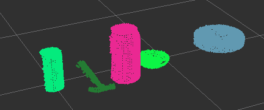
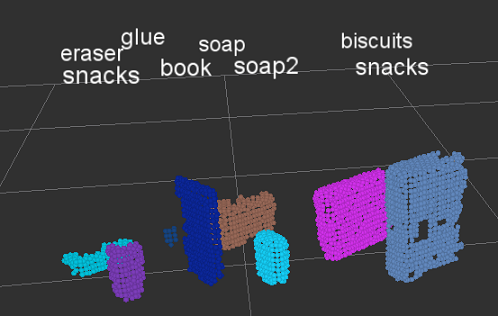

## Project: Perception Pick & Place

---

### Exercise 1, 2 and 3 pipeline implemented
#### 1. Complete Exercise 1 steps. Pipeline for filtering and RANSAC plane fitting implemented.

After doing a few iteration steps in the implementation of the VoxelGrid SownSampling filter I selected the LEAF_SIZE = 0.01

This reduces the computation time more than 3 times and we still have a good representation of the objects in the cloud points

|LEAF_SIZE| POINTS | TIME(ms) |
|:---:|:---:|:---:|
|1|23|790|
|1|868|114|
|1|55336|480|
|0.0001|202627|1530|

For the PassTrought Filter the values for only select the table and the objects on it where: (max, min) = (1.1 , 0.7)

Finally we implemented the RANSAC algorithm for the extraction of the table points an its counterpart. A distance threshold of 0.01 did the job for our points cloud

The following collection of images ilustrate the implementation process for each step:

- Top-left : the original data
- bottom-left: VoxelGrid + PassTrought
- Top-right: RANSAC (objects part)
- Bottom-left: RANSAC (table part)

#### 2. Complete Exercise 2 steps: Pipeline including clustering for segmentation implemented.  

The good documentation of the lessons makes easy follow the steps.

After make the ros publisher and introduce the code from the exercise_1 we can visualize the objects without the table in the working environment.

So the interesting part of this projects is iterate over the parameters of the Euclidean Clustering to isolate correctly the objects on the table. The paramenters that I selected after working a little bit where:

- ClusterTolerance = 0.05
- MinClusterSize = 20
- MaxClusterSize = 2000

However, even when this parameters correctly clustered the objects the edge of the table was clustered as an object. To avoid this I changed the axis_min of the passThrough filter to **0.76**. The result is shown in the following image.

#### 2. Complete Exercise 3 Steps.  Features extracted and SVM trained.  Object recognition implemented.

In this exercise we build all parts together to finally be able to do an object recognition. Is was very interesting implement the histograms part (colors and normal surfaces )and see how this tool can be used to extract features for an SVM training.

Tweaking a little bit wiht the parameters we can achieve a good performance ~80% in my case. However much more higher performances should be achieved training the model a little bit more. With the initial parameters provided by Udacity the confusion matrix had an overall recognition of 65%. Modifying the number of posses and playing with parameters as the number of bins in the histograms or the kernel in the SVM algorithm we can improve this solutions as shown in the table.

|RGB_HSV|bins|orientations|kernel|Accuracy Score|
|:---:|:---:|:---:|:---:|:---:|
|HSV|32|10|linear| 0.657|
|HSV|32|10|rbf| 0.685|
|HSV|32|10|linear|0.757|
|HSV|64|20|linear|0.771|
|HSV|64|20|rbf|0.800|

And the normalized confusion matrix for the final training set

After the training write the ros node to publish the results is easy, in the next image we can see that the new code can recognize various objects on the table. As expected, the model is not very accurate and give  so It will need more training or differents parameters in the next steps.

### Pick and Place Setup

The first new step that we need to implement for the object recognition in the 'real environment' is apply a statistical filter. 
I needed to apply to layers of this filter to get a clean cloud for the objects in the scene. One layer before the vox_grid filter and another after the RANSAC filter, with this two steps I got a clean cloud containing only the objects. 

Another problems was the elimination of the pieces of the boxes that get into the camera view. The first approach was change the parameter 'min_cluster_size' to 70 and this did the job for the first problem. As this paramater was to high for the small objects as the 'glue' I changed the method applying a new passTrought filter, this time in the axis 'y' within the range (-0.5,0.5).

For ease the computation time I changed the number of bins from 64 to 16. I trained all three worlds with a set of 50 poses for each object, using only the RGB spectrum and normal histograms. This settings give me an approximate accuracy of 98%, 93% and 90% for world 1, 2 and 3 respectively. In the next two images we can see the rviz output for the world 2 where the project_template.py script is capable of achieve 4 of 5 objects correctly. The final score for the world 3 was 7 of 8 objects. 

The main difficulty for computing the yaml dictionaries was understand the data structure of the Ros messages. I spend 30 minutes trying to understand where I was failing after I realized that numpy also have its own type for string variables. changing the assignation of the variable object_name.data from 'object.label' to object_list_param[i]['name']  solved the problem.

The final files 'output_1.yaml', 'output_2.yaml', 'output_3.yaml' and the respective trained models 'model*.sav' can be found in the folder './RoboND-Perception-Project/pr2_robot/scripts' of this repository.
